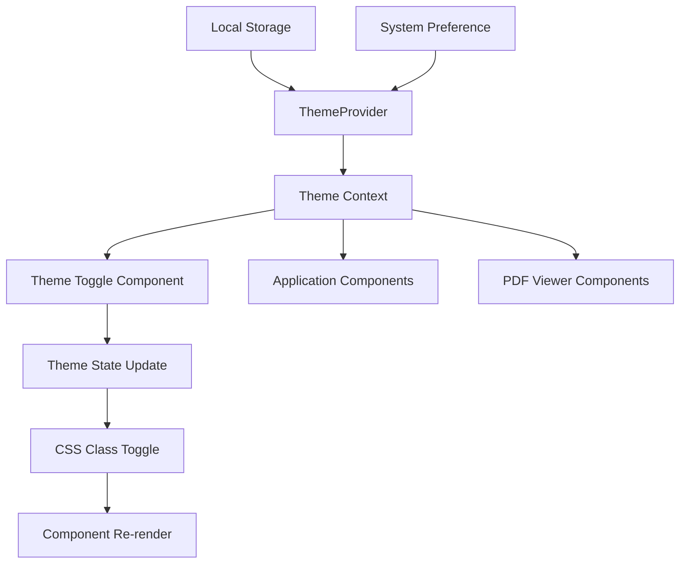
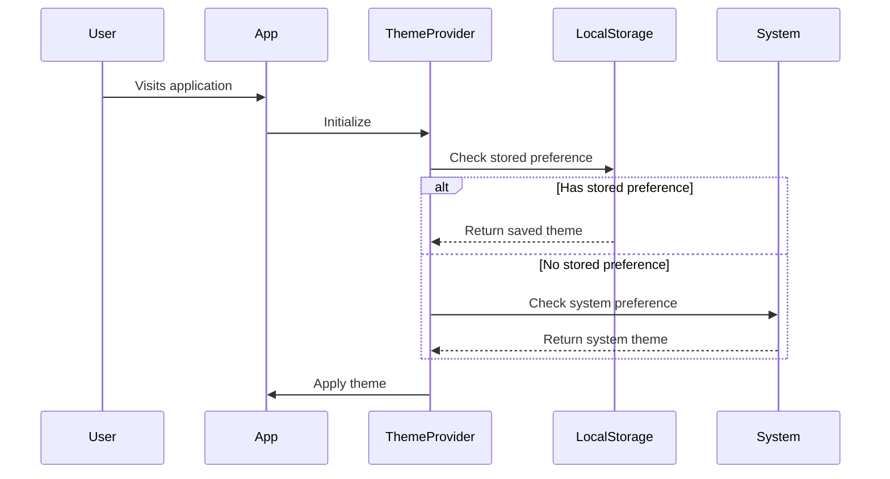

# Design Document

## Overview

The dark theme feature will be implemented using the `next-themes` library combined with Tailwind CSS's built-in dark mode support. This approach provides a robust, performant solution that handles system preference detection, theme persistence, and smooth transitions without hydration issues.

The implementation will use a theme provider pattern that wraps the entire application, allowing any component to access and modify the current theme. The design prioritizes user experience with smooth transitions, proper contrast ratios, and consistent theming across all components including the Syncfusion PDF viewer.

## Architecture

### Theme Management System



### Core Components

1. **ThemeProvider**: Wraps the application and manages theme state
2. **ThemeToggle**: UI component for switching themes
3. **Theme-aware Components**: All existing components updated with dark mode styles
4. **CSS Variable System**: Custom properties for consistent theming

### Theme Detection Flow



## Components and Interfaces

### ThemeProvider Component

```typescript
interface ThemeProviderProps {
  children: React.ReactNode;
  attribute?: string;
  defaultTheme?: string;
  enableSystem?: boolean;
  disableTransitionOnChange?: boolean;
}

interface ThemeContextType {
  theme: string | undefined;
  setTheme: (theme: string) => void;
  resolvedTheme: string | undefined;
  themes: string[];
  systemTheme: string | undefined;
}
```

### ThemeToggle Component

```typescript
interface ThemeToggleProps {
  className?: string;
  size?: "sm" | "md" | "lg";
  variant?: "button" | "switch" | "dropdown";
  showLabel?: boolean;
}
```

### Theme Configuration

```typescript
interface ThemeConfig {
  themes: ["light", "dark", "system"];
  defaultTheme: "system";
  attribute: "class";
  enableSystem: true;
  disableTransitionOnChange: false;
}
```

## Data Models

### Theme State

```typescript
type Theme = "light" | "dark" | "system";

interface ThemeState {
  currentTheme: Theme;
  resolvedTheme: "light" | "dark";
  systemTheme: "light" | "dark";
  isSystemTheme: boolean;
}
```

### Theme Preferences

```typescript
interface ThemePreferences {
  selectedTheme: Theme;
  lastModified: Date;
  autoFollowSystem: boolean;
}
```

## Styling Strategy

### Tailwind Configuration

The implementation will use Tailwind's class-based dark mode strategy:

```javascript
// tailwind.config.js
module.exports = {
  darkMode: "class",
  theme: {
    extend: {
      colors: {
        background: {
          light: "#ffffff",
          dark: "#0f0f0f",
        },
        foreground: {
          light: "#000000",
          dark: "#ffffff",
        },
      },
    },
  },
};
```

### CSS Custom Properties

Define theme-aware CSS variables for consistent theming:

```css
:root {
  --background: 0 0% 100%;
  --foreground: 0 0% 3.9%;
  --card: 0 0% 100%;
  --card-foreground: 0 0% 3.9%;
  --popover: 0 0% 100%;
  --popover-foreground: 0 0% 3.9%;
  --primary: 0 0% 9%;
  --primary-foreground: 0 0% 98%;
}

.dark {
  --background: 0 0% 3.9%;
  --foreground: 0 0% 98%;
  --card: 0 0% 3.9%;
  --card-foreground: 0 0% 98%;
  --popover: 0 0% 3.9%;
  --popover-foreground: 0 0% 98%;
  --primary: 0 0% 98%;
  --primary-foreground: 0 0% 9%;
}
```

### Component Theming Pattern

Each component will use Tailwind's dark: prefix for dark mode styles:

```typescript
// Example component styling
<div className="bg-white dark:bg-gray-900 text-black dark:text-white">
  <button className="bg-blue-500 dark:bg-blue-600 hover:bg-blue-600 dark:hover:bg-blue-700">
    Click me
  </button>
</div>
```

## Syncfusion PDF Viewer Integration

### Theme Customization Strategy

The Syncfusion PDF viewer will be themed using CSS custom properties and component-level styling:

1. **CSS Variable Override**: Override Syncfusion's default CSS variables
2. **Theme-aware Wrapper**: Wrap the PDF viewer in a theme-aware container
3. **Dynamic Style Injection**: Inject theme-specific styles based on current theme

### PDF Viewer Theme Implementation

```css
/* Light theme styles */
.pdf-viewer-light {
  --sf-pdf-viewer-background: #ffffff;
  --sf-pdf-viewer-toolbar-background: #f8f9fa;
  --sf-pdf-viewer-text-color: #212529;
}

/* Dark theme styles */
.pdf-viewer-dark {
  --sf-pdf-viewer-background: #1a1a1a;
  --sf-pdf-viewer-toolbar-background: #2d2d2d;
  --sf-pdf-viewer-text-color: #ffffff;
}
```

## Error Handling

### Theme Loading Errors

```typescript
interface ThemeError {
  type: "THEME_LOAD_ERROR" | "THEME_SAVE_ERROR" | "THEME_APPLY_ERROR";
  message: string;
  fallbackTheme: Theme;
}

const handleThemeError = (error: ThemeError) => {
  console.warn(`Theme error: ${error.message}`);
  // Fallback to system theme or light theme
  setTheme(error.fallbackTheme);
};
```

### Hydration Mismatch Prevention

The implementation will use `next-themes` built-in hydration handling to prevent theme flashing:

```typescript
// Prevent hydration mismatch
const [mounted, setMounted] = useState(false);

useEffect(() => {
  setMounted(true);
}, []);

if (!mounted) {
  return null; // or loading skeleton
}
```

## Testing Strategy

### Unit Tests

1. **Theme Provider Tests**

   - Theme initialization with different scenarios
   - Theme switching functionality
   - Local storage persistence
   - System theme detection

2. **Theme Toggle Tests**

   - Button click handling
   - Keyboard navigation
   - Accessibility compliance
   - Visual state updates

3. **Component Theme Tests**
   - Dark mode class application
   - CSS variable updates
   - Style consistency across themes

### Integration Tests

1. **Theme Persistence Tests**

   - Local storage save/load
   - Theme restoration on page reload
   - Cross-tab synchronization

2. **System Theme Tests**
   - System preference detection
   - Automatic theme switching
   - Override behavior

### Visual Regression Tests

1. **Component Screenshots**

   - Light theme component renders
   - Dark theme component renders
   - Transition states

2. **PDF Viewer Tests**
   - PDF content readability in both themes
   - Annotation visibility and contrast
   - Toolbar theming consistency

### Accessibility Tests

1. **Contrast Ratio Validation**

   - WCAG AA compliance for all text
   - Color contrast in both themes
   - Focus indicator visibility

2. **Keyboard Navigation**
   - Theme toggle accessibility
   - Focus management during theme changes
   - Screen reader compatibility

### Performance Tests

1. **Theme Switch Performance**

   - Transition timing measurements
   - Memory usage during theme changes
   - Bundle size impact analysis

2. **Initial Load Performance**
   - Theme detection speed
   - Hydration performance
   - First contentful paint metrics
