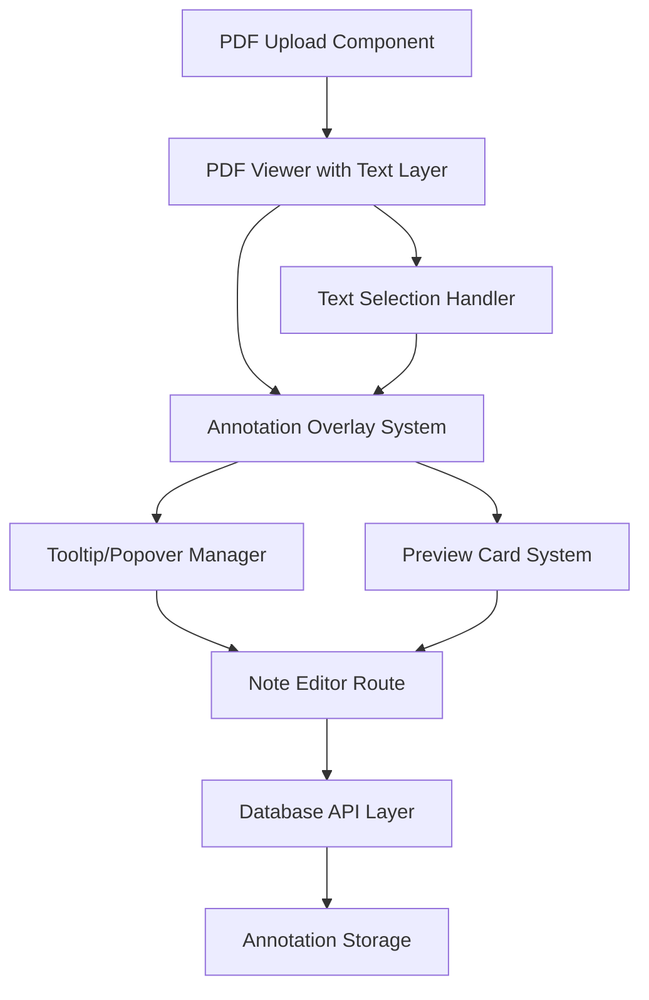

# Design Document

## Overview

The PDF Annotation & Notes feature enables users to upload PDF documents, create annotations by selecting text spans, and write rich-text notes linked to specific PDF locations. The system consists of a PDF viewer with hover-to-annotate functionality, a separate TipTap editor for note creation, and a database-backed storage system for persistent annotations.

## Architecture

### High-Level Architecture



### Technology Stack Integration

- **Frontend Framework**: Next.js 15 with App Router
- **PDF Rendering**: Syncfusion PDF Viewer (`@syncfusion/ej2-react-pdfviewer`)
- **Rich Text Editor**: TipTap with `@tiptap/starter-kit` extensions
- **UI Components**: Radix UI (already in project) for tooltips, popovers, and modals
- **Styling**: Tailwind CSS with blue accent (#3B82F6)
- **State Management**: Redux Toolkit (already in project) for annotation state
- **Authentication**: Clerk (already integrated)
- **Database**: Prototype API endpoints with mock data structure

## Components and Interfaces

### Core Components

#### 1. PDFAnnotationViewer

```typescript
interface PDFAnnotationViewerProps {
  pdfFile: File | null;
  annotations: Annotation[];
  onAnnotationCreate: (selection: TextSelection) => void;
  onAnnotationClick: (annotationId: string) => void;
}
```

**Responsibilities:**

- Render PDF using Syncfusion PDF Viewer
- Manage text selection and hover states
- Display annotation overlays and highlights
- Handle tooltip positioning and visibility

#### 2. AnnotationTooltip

```typescript
interface AnnotationTooltipProps {
  position: { x: number; y: number };
  visible: boolean;
  onCreateNote: () => void;
  onClose: () => void;
}
```

**Responsibilities:**

- Display "Create note" button on text hover with blue accent styling (#3B82F6) and subtle drop shadow
- Handle positioning near viewport edges with automatic repositioning
- Manage fade-in/fade-out animations with 200ms delay on cursor leave
- Use transition-opacity duration-200 for smooth animations

#### 3. AnnotationPreviewCard

```typescript
interface AnnotationPreviewCardProps {
  annotation: Annotation;
  position: { x: number; y: number };
  visible: boolean;
  onEdit: (annotationId: string) => void;
  onClose: () => void;
}
```

**Responsibilities:**

- Show preview of annotation content (~100 characters)
- Handle click-to-edit functionality
- Manage smooth animations and positioning

#### 4. NoteEditor (Route Component)

```typescript
interface NoteEditorProps {
  annotationId?: string;
  initialData?: {
    selectedText: string;
    pdfReference: string;
    pageNumber: number;
    coordinates: Rectangle;
  };
}
```

**Responsibilities:**

- Render TipTap editor with formatting options
- Handle note saving and navigation
- Pre-populate editor with selected text and PDF reference information
- Generate PDF location hyperlinks in format: `#pdf?page=3&x=120&y=450&width=200&height=18`
- Provide "Back to PDF" navigation link
- Handle "Save & Close" functionality with tab management

### Data Models

#### Annotation Model

```typescript
interface Annotation {
  id: string;
  userId: string;
  pdfId: string;
  pageNumber: number;
  selectedText: string;
  noteContent: string;
  coordinates: Rectangle;
  createdAt: Date;
  updatedAt: Date;
}

interface Rectangle {
  x: number;
  y: number;
  width: number;
  height: number;
}

interface TextSelection {
  text: string;
  pageNumber: number;
  coordinates: Rectangle;
  pdfId: string;
}
```

#### PDF Document Model

```typescript
interface PDFDocument {
  id: string;
  userId: string;
  filename: string;
  uploadedAt: Date;
  fileUrl: string; // For prototype, use blob URLs
}
```

## Components and Interfaces

### PDF Viewer Integration

**Library Choice**: Syncfusion PDF Viewer (`@syncfusion/ej2-react-pdfviewer`)

- Provides robust text layer support for selection with built-in text search capabilities
- Handles page navigation, zoom, and rotation seamlessly
- Supports custom annotation overlays and programmatic text selection
- Enterprise-grade performance with large PDF files
- Built-in accessibility features and keyboard navigation

**Text Selection Strategy**:

1. Leverage Syncfusion's textSelectionStart and textSelectionEnd events
2. Use getSelectedText() API to capture exact text content
3. Calculate bounding rectangles using Syncfusion's selection bounds API
4. Store selections with page-relative positioning for consistency across zoom levels

### Annotation Overlay System

**Rendering Strategy**:

- Use absolute positioning over PDF pages
- Calculate coordinates relative to page dimensions
- Handle zoom and scroll transformations
- Maintain visual consistency across different viewport sizes

**Highlight Styling**:

```css
.annotation-highlight {
  background-color: rgba(59, 130, 246, 0.2);
  border-bottom: 2px solid #3b82f6;
  transition: all 200ms ease-in-out;
}

.annotation-highlight:hover {
  background-color: rgba(59, 130, 246, 0.3);
}
```

### State Management Architecture

**Redux Store Structure**:

```typescript
interface AnnotationState {
  currentPdf: PDFDocument | null;
  annotations: Record<string, Annotation>;
  activeSelection: TextSelection | null;
  hoveredAnnotation: string | null;
  tooltipState: {
    visible: boolean;
    position: { x: number; y: number };
  };
  previewCard: {
    visible: boolean;
    annotationId: string | null;
    position: { x: number; y: number };
  };
}
```

**Actions**:

- `setPdfDocument(pdf: PDFDocument)`
- `loadAnnotations(annotations: Annotation[])`
- `createAnnotation(selection: TextSelection)`
- `updateAnnotation(id: string, updates: Partial<Annotation>)`
- `setActiveSelection(selection: TextSelection | null)`
- `showTooltip(position: { x: number; y: number })`
- `hideTooltip()`
- `showPreviewCard(annotationId: string, position: { x: number; y: number })`
- `hidePreviewCard()`

## Data Models

### Database Schema (Prototype)

**Annotations Table**:

```sql
CREATE TABLE annotations (
  id UUID PRIMARY KEY DEFAULT gen_random_uuid(),
  user_id VARCHAR NOT NULL,
  pdf_id VARCHAR NOT NULL,
  page_number INTEGER NOT NULL,
  selected_text TEXT NOT NULL,
  note_content TEXT NOT NULL,
  coordinates JSONB NOT NULL, -- {x, y, width, height}
  created_at TIMESTAMP DEFAULT NOW(),
  updated_at TIMESTAMP DEFAULT NOW()
);

CREATE INDEX idx_annotations_pdf_page ON annotations(pdf_id, page_number);
CREATE INDEX idx_annotations_user ON annotations(user_id);
```

**PDF Documents Table**:

```sql
CREATE TABLE pdf_documents (
  id UUID PRIMARY KEY DEFAULT gen_random_uuid(),
  user_id VARCHAR NOT NULL,
  filename VARCHAR NOT NULL,
  file_url TEXT, -- For prototype, store blob URLs or file paths
  uploaded_at TIMESTAMP DEFAULT NOW()
);
```

### API Endpoints (Prototype)

**Annotation Management**:

- `GET /api/annotations?pdfId={id}&page={number}` - Get annotations for a PDF page
- `POST /api/annotations` - Create new annotation
- `PUT /api/annotations/{id}` - Update annotation
- `DELETE /api/annotations/{id}` - Delete annotation

**PDF Management**:

- `POST /api/pdfs/upload` - Upload PDF file
- `GET /api/pdfs/{id}` - Get PDF metadata
- `GET /api/pdfs/{id}/content` - Get PDF file content

## Error Handling

### PDF Loading Errors

- **File Format Issues**: Display user-friendly error for unsupported files
- **Large File Handling**: Show progress indicator and handle memory constraints
- **Network Errors**: Provide retry mechanism for file uploads

### Annotation Errors

- **Text Selection Failures**: Gracefully handle cases where text cannot be selected
- **Coordinate Calculation Issues**: Fallback to approximate positioning
- **Save Failures**: Show error message and allow retry with local storage backup

### Editor Errors

- **TipTap Loading Issues**: Provide fallback to basic textarea
- **Save Conflicts**: Handle concurrent editing scenarios
- **Navigation Errors**: Ensure users can always return to PDF viewer

## Testing Strategy

### Unit Testing

- **Text Selection Logic**: Test coordinate calculation and text extraction
- **Annotation Rendering**: Verify highlight positioning and styling
- **State Management**: Test Redux actions and reducers
- **API Integration**: Mock API calls and test error scenarios

### Integration Testing

- **PDF Viewer Integration**: Test annotation overlay with different PDF types
- **Editor Integration**: Test note creation and editing workflows
- **Database Integration**: Test annotation persistence and retrieval

### End-to-End Testing

- **Complete Annotation Workflow**: Upload PDF → Select text → Create note → View annotation
- **Cross-Tab Communication**: Test editor-to-viewer navigation
- **Responsive Behavior**: Test on different screen sizes and devices

### Performance Testing

- **Large PDF Handling**: Test with documents of various sizes
- **Multiple Annotations**: Test performance with many annotations per page
- **Memory Usage**: Monitor for memory leaks during extended use

## Responsive Design Considerations

### Desktop Experience

- Hover-based tooltips with smooth animations
- Side-by-side PDF and note editing (future enhancement)
- Keyboard shortcuts for common actions

### Mobile Experience

- Tap-to-select instead of hover for text selection
- Full-screen modal for "Create note" using Radix UI Dialog instead of tooltip
- Touch-friendly annotation previews with larger tap targets
- Optimized PDF viewer for touch navigation and gestures

### Accessibility

- Keyboard navigation for all interactive elements
- Screen reader support for annotations
- High contrast mode compatibility
- Focus management for modal interactions
