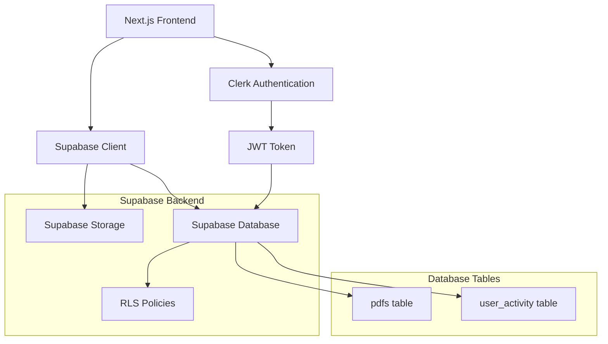

# Design Document

## Overview

This design implements a comprehensive backend integration using Supabase for PDF file storage and database management, replacing the current mock database implementation. The system will provide secure PDF upload to Supabase Storage, metadata storage in Supabase Database, user activity tracking, and a dashboard interface for file management. The integration leverages Clerk authentication with Supabase's Row Level Security (RLS) for secure data access.

## Architecture

### High-Level Architecture



### Component Integration

- **Frontend**: Next.js 15 with App Router handles UI and client-side logic
- **Authentication**: Clerk provides user authentication and JWT tokens
- **Storage**: Supabase Storage manages PDF file uploads with signed URLs
- **Database**: Supabase PostgreSQL stores metadata and activity tracking
- **Security**: Row Level Security (RLS) ensures users only access their data

## Components and Interfaces

### Database Schema

#### PDFs Table

```sql
CREATE TABLE pdfs (
  id UUID PRIMARY KEY DEFAULT gen_random_uuid(),
  user_id TEXT NOT NULL, -- Clerk user ID
  filename TEXT NOT NULL,
  file_size BIGINT NOT NULL,
  storage_path TEXT NOT NULL, -- Path in Supabase Storage
  mime_type TEXT NOT NULL DEFAULT 'application/pdf',
  uploaded_at TIMESTAMP WITH TIME ZONE DEFAULT NOW(),
  updated_at TIMESTAMP WITH TIME ZONE DEFAULT NOW(),

  CONSTRAINT pdfs_user_id_check CHECK (char_length(user_id) > 0),
  CONSTRAINT pdfs_filename_check CHECK (char_length(filename) > 0),
  CONSTRAINT pdfs_file_size_check CHECK (file_size > 0)
);

-- RLS Policies
ALTER TABLE pdfs ENABLE ROW LEVEL SECURITY;

CREATE POLICY "Users can only access their own PDFs" ON pdfs
  FOR ALL USING (user_id = requesting_user_id());

-- Indexes for performance
CREATE INDEX idx_pdfs_user_id ON pdfs(user_id);
CREATE INDEX idx_pdfs_uploaded_at ON pdfs(uploaded_at DESC);
```

#### User Activity Table

```sql
CREATE TABLE user_activity (
  id UUID PRIMARY KEY DEFAULT gen_random_uuid(),
  user_id TEXT NOT NULL, -- Clerk user ID
  pdf_id UUID NOT NULL REFERENCES pdfs(id) ON DELETE CASCADE,
  activity_type TEXT NOT NULL DEFAULT 'view',
  accessed_at TIMESTAMP WITH TIME ZONE DEFAULT NOW(),

  CONSTRAINT user_activity_user_id_check CHECK (char_length(user_id) > 0),
  CONSTRAINT user_activity_type_check CHECK (activity_type IN ('view', 'upload', 'delete'))
);

-- RLS Policies
ALTER TABLE user_activity ENABLE ROW LEVEL SECURITY;

CREATE POLICY "Users can only access their own activity" ON user_activity
  FOR ALL USING (user_id = requesting_user_id());

-- Indexes for performance
CREATE INDEX idx_user_activity_user_id ON user_activity(user_id);
CREATE INDEX idx_user_activity_accessed_at ON user_activity(accessed_at DESC);
CREATE INDEX idx_user_activity_pdf_id ON user_activity(pdf_id);
```

#### Clerk Integration Function

```sql
-- Function to extract Clerk user ID from JWT
CREATE OR REPLACE FUNCTION requesting_user_id()
RETURNS TEXT
LANGUAGE SQL
STABLE
AS $$
  SELECT COALESCE(
    current_setting('request.jwt.claims', true)::json->>'sub',
    (current_setting('request.jwt.claims', true)::json->>'user_metadata')::json->>'user_id'
  )::text;
$$;
```

### API Endpoints

#### PDF Upload API (`/api/pdfs/upload`)

```typescript
interface UploadRequest {
  file: File; // PDF file from FormData
}

interface UploadResponse {
  success: boolean;
  data?: {
    id: string;
    filename: string;
    fileSize: number;
    uploadedAt: string;
    fileUrl: string; // Signed URL for viewing
  };
  error?: string;
}
```

#### PDF List API (`/api/pdfs`)

```typescript
interface PDFListResponse {
  success: boolean;
  data?: {
    pdfs: Array<{
      id: string;
      filename: string;
      fileSize: number;
      uploadedAt: string;
      fileUrl: string; // Signed URL
    }>;
    recentActivity?: {
      pdfId: string;
      filename: string;
      accessedAt: string;
      fileUrl: string;
    };
  };
  error?: string;
}
```

#### PDF Access API (`/api/pdfs/[id]`)

```typescript
interface PDFAccessResponse {
  success: boolean;
  data?: {
    id: string;
    filename: string;
    fileUrl: string; // Fresh signed URL
    fileSize: number;
  };
  error?: string;
}
```

### Frontend Components

#### Dashboard Component Updates

```typescript
interface DashboardState {
  pdfs: PDFDocument[];
  recentActivity: UserActivity | null;
  isLoading: boolean;
  error: string | null;
}

interface PDFDocument {
  id: string;
  filename: string;
  fileSize: number;
  uploadedAt: Date;
  fileUrl: string;
}

interface UserActivity {
  pdfId: string;
  filename: string;
  accessedAt: Date;
  fileUrl: string;
}
```

#### Upload Component

```typescript
interface UploadComponentProps {
  onUploadSuccess: (pdf: PDFDocument) => void;
  onUploadError: (error: string) => void;
}

interface UploadState {
  isUploading: boolean;
  progress: number;
  error: string | null;
}
```

## Data Models

### Supabase Client Configuration

```typescript
// lib/supabaseClient.ts
import { createClient } from "@supabase/supabase-js";

const supabaseUrl = process.env.NEXT_PUBLIC_SUPABASE_URL!;
const supabaseAnonKey = process.env.NEXT_PUBLIC_SUPABASE_ANON_KEY!;

export const supabase = createClient(supabaseUrl, supabaseAnonKey, {
  auth: {
    persistSession: false, // Using Clerk for auth
  },
});

// Function to get authenticated Supabase client with Clerk token
export const getAuthenticatedSupabaseClient = async () => {
  const { getToken } = auth();
  const token = await getToken({ template: "supabase" });

  return createClient(supabaseUrl, supabaseAnonKey, {
    global: {
      headers: {
        Authorization: `Bearer ${token}`,
      },
    },
    auth: {
      persistSession: false,
    },
  });
};
```

### Storage Configuration

```typescript
// Storage bucket configuration
const STORAGE_BUCKET = "pdfs";
const MAX_FILE_SIZE = 50 * 1024 * 1024; // 50MB
const ALLOWED_MIME_TYPES = ["application/pdf"];
const SIGNED_URL_EXPIRY = 3600; // 1 hour
```

### TypeScript Interfaces

```typescript
// lib/types.ts
export interface PDFDocument {
  id: string;
  userId: string;
  filename: string;
  fileSize: number;
  storagePath: string;
  mimeType: string;
  uploadedAt: Date;
  updatedAt: Date;
  fileUrl?: string; // Signed URL for frontend use
}

export interface UserActivity {
  id: string;
  userId: string;
  pdfId: string;
  activityType: "view" | "upload" | "delete";
  accessedAt: Date;
}

export interface UploadProgress {
  loaded: number;
  total: number;
  percentage: number;
}
```

## Error Handling

### Error Types and Responses

```typescript
export enum ErrorType {
  AUTHENTICATION_ERROR = "AUTHENTICATION_ERROR",
  VALIDATION_ERROR = "VALIDATION_ERROR",
  STORAGE_ERROR = "STORAGE_ERROR",
  DATABASE_ERROR = "DATABASE_ERROR",
  NETWORK_ERROR = "NETWORK_ERROR",
  FILE_TOO_LARGE = "FILE_TOO_LARGE",
  INVALID_FILE_TYPE = "INVALID_FILE_TYPE",
  QUOTA_EXCEEDED = "QUOTA_EXCEEDED",
}

export interface APIError {
  type: ErrorType;
  message: string;
  details?: any;
  retryable: boolean;
}
```

### Error Handling Strategy

1. **Client-side validation**: File type, size, and format validation before upload
2. **Server-side validation**: Additional security checks and sanitization
3. **Storage errors**: Handle Supabase Storage quota, permissions, and network issues
4. **Database errors**: Handle connection issues, constraint violations, and RLS failures
5. **Authentication errors**: Handle expired tokens, invalid permissions, and Clerk integration issues
6. **User feedback**: Clear, actionable error messages with retry options where appropriate

### Retry Logic

```typescript
const retryableErrors = [
  ErrorType.NETWORK_ERROR,
  ErrorType.STORAGE_ERROR,
  ErrorType.DATABASE_ERROR,
];

const retryConfig = {
  maxRetries: 3,
  backoffMultiplier: 2,
  initialDelay: 1000,
};
```

## Testing Strategy

### Unit Tests

- **API Routes**: Test upload, list, and access endpoints with mocked Supabase
- **Database Operations**: Test CRUD operations and RLS policies
- **File Validation**: Test client and server-side validation logic
- **Error Handling**: Test all error scenarios and retry mechanisms

### Integration Tests

- **Clerk + Supabase**: Test authentication flow and JWT token handling
- **Storage Operations**: Test file upload, download, and signed URL generation
- **Database + Storage**: Test metadata consistency between database and storage
- **Cross-tab Communication**: Test activity tracking and real-time updates

### End-to-End Tests

- **Complete Upload Flow**: User authentication → file selection → upload → dashboard update
- **File Access Flow**: Dashboard → file selection → PDF viewer → activity tracking
- **Error Scenarios**: Network failures, authentication errors, file validation failures

### Performance Tests

- **Large File Uploads**: Test 50MB PDF uploads with progress tracking
- **Concurrent Operations**: Test multiple users uploading simultaneously
- **Database Performance**: Test query performance with large datasets
- **Storage Performance**: Test signed URL generation and file access speed

## Security Considerations

### Authentication and Authorization

- **Clerk Integration**: Secure JWT token handling and validation
- **Row Level Security**: Database-level access control using Clerk user IDs
- **API Route Protection**: Middleware to verify authentication on all endpoints
- **Storage Bucket Policies**: Restrict access to authenticated users only

### File Security

- **File Type Validation**: Server-side MIME type and magic number validation
- **File Size Limits**: Enforce 50MB limit to prevent abuse
- **Virus Scanning**: Consider integration with file scanning services
- **Content Sanitization**: Validate PDF structure and remove potentially malicious content

### Data Protection

- **Signed URLs**: Time-limited access to storage files
- **HTTPS Only**: Enforce secure connections for all operations
- **Input Sanitization**: Validate and sanitize all user inputs
- **SQL Injection Prevention**: Use parameterized queries and ORM protection

### Privacy and Compliance

- **Data Isolation**: Ensure users can only access their own files
- **Audit Logging**: Track all file operations for security monitoring
- **Data Retention**: Implement policies for file and activity data cleanup
- **GDPR Compliance**: Support user data export and deletion requests
