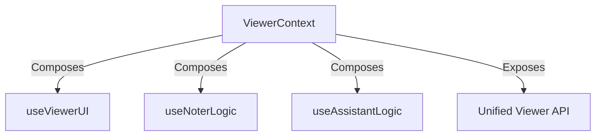

# Viewer Context Architecture

The `ViewerContext` serves as the central state management layer for the Document View feature. It uses a **compositional architecture**, aggregating logic from several specialized hooks to provide a unified API for the UI components.

## Architecture Overview



## Core Components

### 1. ViewerContext (`ViewerContext.tsx`)

**Role**: The main entry point. It initializes the feature's state and provides the `useViewer()` hook for consumption by child components.
**Responsibilities**:

- Instantiates the helper hooks.
- Implements shared/bridge logic that requires access to multiple domains (e.g., `handleAddToNotes` needs access to both Assistant content and Note logic).
- Exposes the final API.

### 2. Specialized Hooks

#### `useViewerUI`

**Domain**: Interface State
**Manages**:

- Panel visibility (`isAssistantOpen`, `isNoterOpen`)
- Toggle actions

#### `useNoterLogic`

**Domain**: Note-Taking Feature
**Manages**:

- **Tabs**: State of open note tabs.
- **Notes Data**: Fetching, sorting, and caching notes via Redux Query.
- **CRUD**: Creating, updating, and deleting notes.
- **Selection**: Tracking the active note tab.

#### `useAssistantLogic`

**Domain**: AI Integration
**Manages**:

- **Chat State**: List of messages (`user` vs `assistant`).
- **Interaction**: Sending messages to the AI backend.
- **History**: Transforming message history for the AI context.

## Shared Actions

These actions are implemented directly in `ViewerContext` because they orchestrate interactions between the specialized domains.

- **`handleAddToNotes(content)`**:
  - _Trigger_: User clicks "Add to notes" on a chat message or selection.
  - _Logic_: Checks if a note is open. If so, updates that note. If not, creates a new note. Uses `useNoterLogic` primitives.
- **`handleAddToNoteAsInsight(content)`**:
  - _Trigger_: User clicks "Add as Insight".
  - _Logic_: Wraps the content in a specialized Tiptap `insight` node structure (with metadata) before passing it to the note creation/update logic.

## Usage

Components within the document view should use the `useViewer` hook to access this functionality.

```tsx
import { useViewer } from "@/features/document-view/context/ViewerContext";

function MyComponent() {
  const {
    // UI
    toggleAssistant,
    // Notes
    activeTabId,
    handlers,
    // Assistant
    messages,
    addUserMessage,
  } = useViewer();

  // ...
}
```
